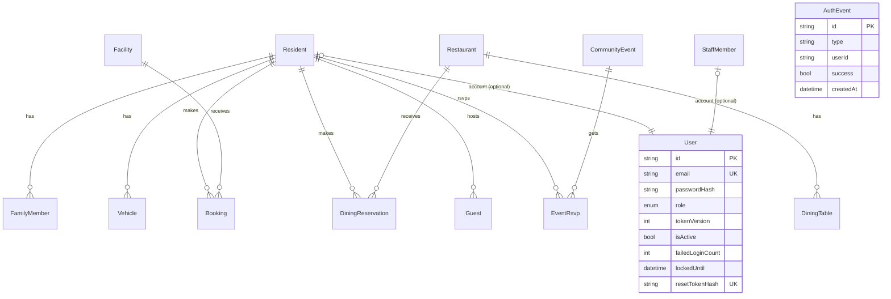

# StayFlow — Schema

> Source of truth is `server/prisma/schema.prisma` — this doc summarizes it. Business rules built on top of this schema: [Rules.md](Rules.md).

**Datasource:** PostgreSQL. **PKs:** `cuid()` text ids on all models. **Migration:** `server/prisma/migrations/0_init`.

## Tables (16) + enums (7)

`residents`, `family_members`, `vehicles`, `staff_members`, `facilities`, `bookings`, `restaurants`, `dining_tables`, `dining_reservations`, `guests`, `events`, `event_rsvps`, `notices`, `notifications`, `users`, `auth_events`.

Enums: `MembershipTier`, `BookingStatus`, `FacilityStatus`, `TableStatus`, `DiningReservationStatus`, `GuestStatus`, `PortalRole`.

## Keys / constraints / indexes

- **Unique:** `residents.email`, `staff_members.email`, `guests.passNumber`, `users.email`, `users.residentId`, `users.staffId`, `users.resetTokenHash`, `event_rsvps (eventId,residentId)`.
- **FKs:** `family_members`/`vehicles`/`bookings`/`dining_reservations`/`guests`/`event_rsvps` → `Resident`; `bookings` → `Facility`; `dining_tables`/`dining_reservations` → `Restaurant`; `users` → `Resident?`/`StaffMember?`.
- **Cascade delete:** `family_members`, `vehicles`, `event_rsvps`.
- **Indexes:** `auth_events` on `userId`, `type`, `createdAt`.
- `auth_events` intentionally has **no FK** to `users` — audit history outlives deleted accounts.

## ER Diagram

## State-bearing enums

| Enum | Values (see schema for exact set) | Governs |
| --- | --- | --- |
| `BookingStatus` | PENDING → CONFIRMED / CANCELLED | Facility bookings |
| `DiningReservationStatus` | mirrors booking lifecycle | Dining reservations |
| `GuestStatus` | PENDING → APPROVED → CHECKED_IN → CHECKED_OUT | Guest pass lifecycle |
| `FacilityStatus` / `TableStatus` | availability state | Facility / dining-table listing |
| `PortalRole` | MEMBER / STAFF / MANAGEMENT | `users.role`, drives RBAC |
| `MembershipTier` | resident tier | `residents.membershipTier` |

## Schema-change workflow

1. Edit `server/prisma/schema.prisma`.
2. Dev: `npm run prisma:migrate` (in `server/`) — generates + applies a new migration.
3. Prod: `npm run prisma:deploy` — applies pending migrations only, no interactive prompts.
4. Never hand-edit an already-applied migration SQL file; ship a compensating migration instead.
